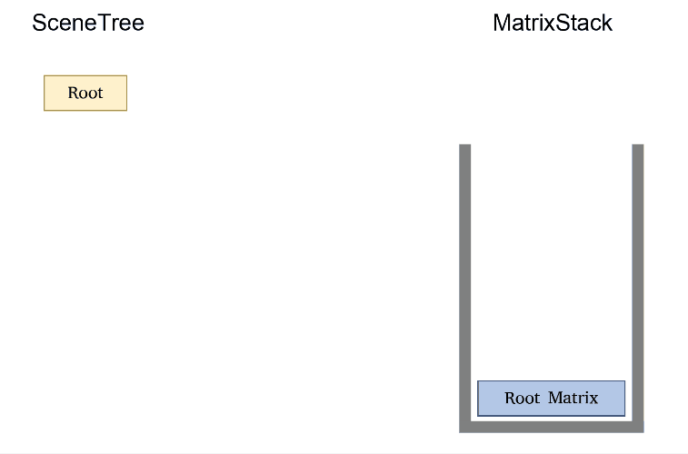
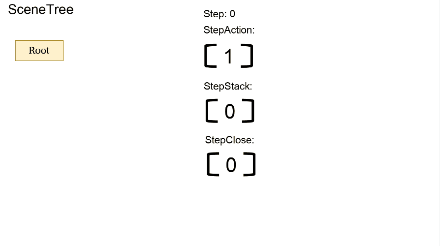
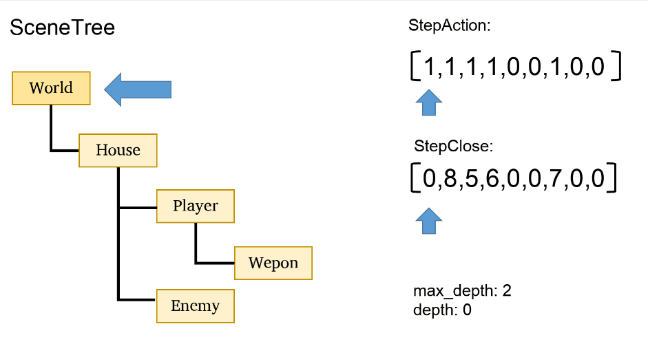

传统的渲染引擎或游戏引擎大多都是先有用户构建的`场景树`再有`矩阵堆栈`，也就是由`持久状态`生成`执行过程`。用户只需要维护`场景树`。这很符合直觉。

不过我认为渲染器不应该持有像`场景树`这样在不同帧之间持久存在的状态，因为这不在它的功能范围内。这是游戏引擎之类的工作。那如果将这个过程反过来。我们让用户使用`矩阵堆栈`来生成“场景树”。使用者则无需维护`场景树`反而维护`矩阵堆栈`。会怎么样呢？

先来看看最古老的`Canvas 2D`，比如玩家拿着武器的场景这样构建它

```js
ctx.save();
    ctx.translate(camera.x, camera.y);
    ctx.drawImage(playerImg, player.x, player.y);

    ctx.save();
        ctx.translate(weaponImg.x, weaponImg.y);
        ctx.rotate(weaponImg.angle);
        ctx.drawImage(weaponImg, 0, 0);
    ctx.restore();
ctx.restore();

ctx.drawImage(hpBarImg, 10, 10);
```



这个就是手动操作矩阵堆栈，也就是手动调用`ctx.save`/`ctx.restore`的执行过程来构建场景。这很酷。但是这样会有问题出现，这些问题在场景树里都可以避免：

- 出栈即销毁，一旦 `restore()`，刚刚辛辛苦苦算出来的世界矩阵就灰飞烟灭了。如果游戏逻辑需要用到某个部件的全局坐标，根本无从获取。

- 丢失依赖拓扑关系。系统不知道谁是谁的子节点，无法局部更新。
- 变换与绘制调用被强行锁死在同一时刻。很难自由的做 Y-Sort 等图层排序
- 无法做逆向空间解算，每个节点没有自己的局部坐标系
- 必须用嵌套代码还原空间关系，你的代码调用顺序必须按照父子层级结构

这看起来很多，但是我们可以归纳成两个问题：

- 从时间维度上：矩阵出栈之后消失，代码调用顺序必须按照父子层级结构
- 从空间维度上：丢失父子的拓扑关系，无法局部/按依赖更新

时间维度的问题很简单。只需要在 `save` 的时候保留着这个矩阵。后续在执行 `restore` 时，仅将其从 matrixStack 状态栈中移出，而不销毁或覆盖此前保留的历史矩阵即可

```ts
const world = stack.save();
stack.translate(200, 200);

const enemyNode = stack.save();
stack.translate(80, 0);

stack.restore(); // enemyNode
stack.restore(); // world

rapid.drawSprite({
  texture: enemy,
  customMatrix: enemyNode.world,
});
```

或是直接复制矩阵到当前martixstack顶层

```ts
const enemyNode = stack.save();
matrix.copy(enemyNode, otherNode)
rapid.drawSprite({texture: enemy});
```

但是接下来复杂的问题就来了。我们有了以上的操作。如何确保拓扑关系仍然正确？

`save`/`restore` 产生的拓扑形态 是一个从任意节点沿着走，永远不会经过起点的图。也就是`有向无环图`。那么存储这个结构。只需要把每次`save()`,`restore()`都视作一个step，并在每个 Step 阶段记录当前动作类型及变换矩阵快照。

```ts
// save = 1
// restore = 0

// save()     1  root                   
// save()     1  ├── world              
//               │   ├── player
// save()     1  │   └── enemies          
//               │       ├── enemy #0
//               │       ├── enemy #1
//               │       └── ...
// restore()  0  │                        
// restore()  0  │                        
// restore()  0  └── ui                   

const stepAction = [1, 1, 1, 0, 0, 0]
const stepWorldMatrix = [...]
const steplocalMatrix = [...]
```

基于这样的设计，我们仅通过  `stepAction`, `stepWorldMatrix` 和 `steplocalMatrix`等数个数组，便能以极低的内存开销，完整的记录整个MatrixStack操作的拓扑形态。`stepAction` 也是个场景树。`1`代表更深，`0`代表更浅。也就是说我们用matrixstack的过程创建了一个`场景树`

可以设计一个遍历子节点的功能。一直往下走直到作用域结束。也就是深度再次被 `restore` 回到开始时。这样就可以做依赖更新，获取子节点等等像在`场景树`里面一样的操作。而这个场景树是由matrixstack构建而成。而非场景树构建matrixstack

不过，我们只需要获取特定深度的子节点的时候，这样就是`O(allchildren)`。开销过大，因为他会按着`stepAction`走完矩阵作用域里的每一个节点。
必须记录每个`save()`在第几步`restore()`，这样我们就能跳过不需要的深度。只需要再维护一个保存step的stack，然后在`restore()`的时候pop这个stack把信息存储到`stepClose`代表第n次step的save在第几个step完整退出这个作用域

```ts
save() {
    this.stack.push(this.curWorldM)
    
    this.stepAction.push(1)
    this.stepClose.push(0)
    this.stepStack.push(this.step)
    this.matrix.copy(this.curWorldM, parentWorldM);

    ...
}

restore() {
    if (this.stack.length == 0 || this.stepStack.length == 0) {
        return;
    } else {
        this.stepAction.push(0);
        this.stepClose.push(0); // placeholder，保持step位置对应其他step array
        this.stepClose[this.stepStack.pop()] = this.step;

        ...
    }
}
```



这样我们就能设计一个遍历孙子节点的函数，并且只获取depth=2的子开销也是O(children_size)

```ts
const walkSubtree = (
    startIndex: number,
    callback: (index: number, action: number, depth: number) => boolean | void,
    maxDepth: number = Infinity
) => {
    let depth = 0;
    let index = startIndex;

    while (index < this.step) {
        const action = this.stepAction.get(index);

        if (action === 1) {
            depth++;
            // 如果当前深度超过了 maxDepth，则跳过这棵子树
            if (depth > maxDepth) {
                const endIndex = this.stepClose.get(index);
                if (endIndex > index) {
                    index = endIndex + 1; // 跳到 restore 之后
                    depth--; // 因为跳过了这个 save 对应的 restore，深度应该减回
                    continue;
                }
            }
        } else {
            depth--;
        }

        // 回调在更新深度后调用
        if (callback(index, action, depth) === false) return;

        // 遇到关闭起始节点的 restore，子树结束
        if (action === 0 && depth === 0) return;

        index++;
    }
}

```



有了这个，就能做一些依赖于拓扑结构的操作了。比如要更新依赖的子节点

```ts
const startIdx = ...

this.walkSubtree(startIdx, (index, action) => {
    if (action === 1) { // action == 1 代表 save()
        const worldMatrix = this.stepWorldM.get(index)
        const localMatrix = this.stepLocalM.get(index)
        const parentMatrix = this.stepParentM.get(index)
        this.matrix.multiplyOut(worldMatrix, parentMatrix, localMatrix)
    }
})
```

所以，不需要维护场景树。仅仅使用`save()`/`restore()`就能实现与场景树一样灵活的操作

但有人可能会问：如果没有了场景树的脏标记，遇到极其庞大的静态场景，难道每帧都要无脑走一遍矩阵堆栈吗？

可以在每次渲染的时候缓存这个worldmatrix。如果没有任何父节点改变的话。那就直接在save的时候替换worldmatrix即可

```ts
const lastNode = stack.save()
const lastWorldMatrix = matrix.getMatrix(lastNode.world)

...

const node = stack.save()
matrix.setMatrix(node.world)
// 此时仍然在matrixstack里面node的子节点仍然可以符合层级变换
```

`rapid.js`的matrixstack设计与传统的对象树的区别有一点类似`vue.js`和`React`的区别。一个面向过程与执行流，一个是面向数据维护着一棵对象树。
